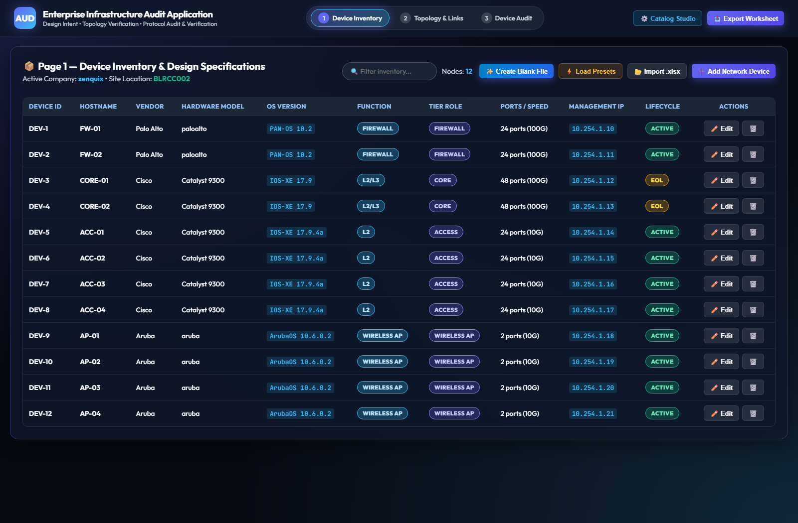
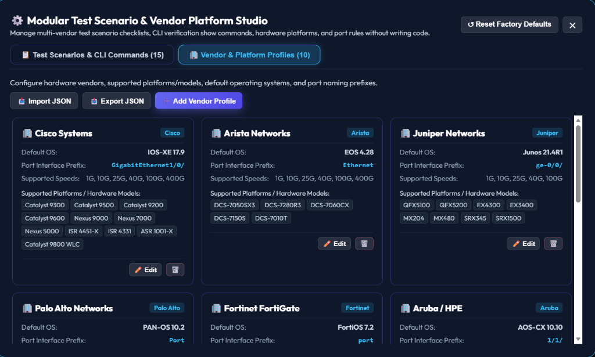
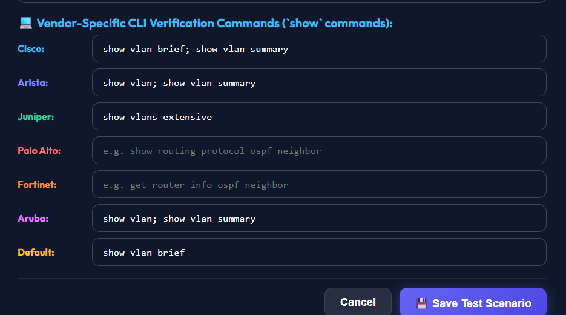
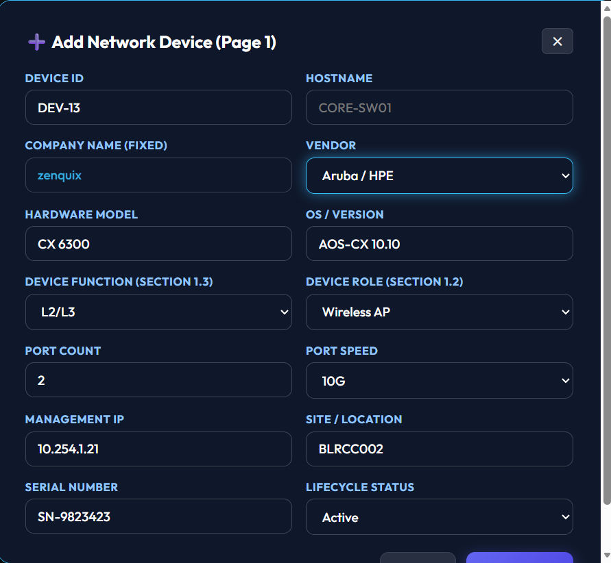
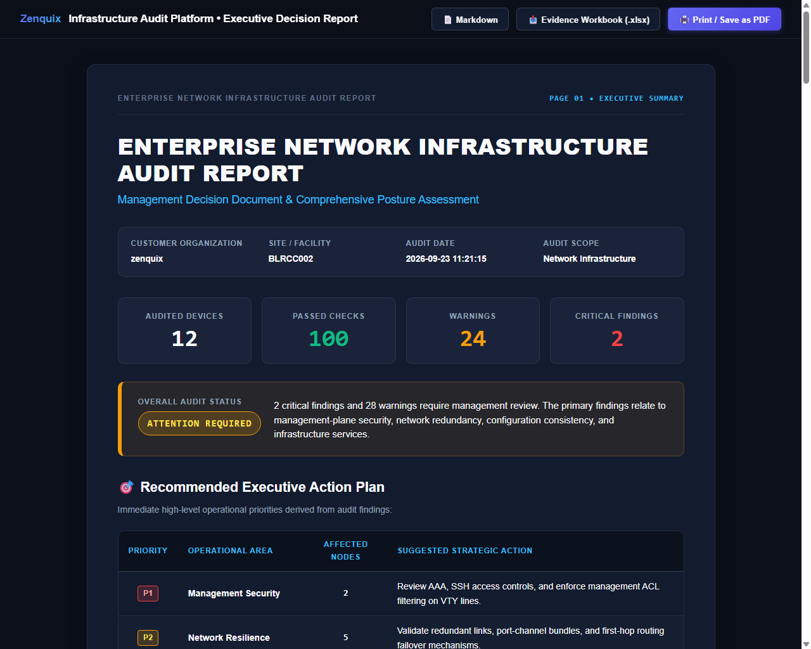

# 🌐 Enterprise Network Infrastructure Audit Platform

[](LICENSE)
[](https://python.org)
[](https://fastapi.tiangolo.com)
[](SECURITY.md)
[](docs/data-privacy.md)
[](sbom/sbom.spdx.json)

An enterprise-grade, multi-vendor network infrastructure auditing, discovery, configuration validation, and compliance verification platform. Designed for network engineers, compliance auditors, and enterprise operations teams to systematically interrogate network infrastructure, evaluate multi-vendor protocol compliance, stream live CLI verification commands with **Zero-Storage Ephemeral Credentials**, and generate publication-ready executive reports and multi-tab Excel audit workbooks.

---

## 🏛️ System Architecture

```text
               ┌─────────────────────────────────────────┐
               │    Network Auditor / Web Browser UI     │
               └────────────────────┬────────────────────┘
                                    │ HTTP / REST / SSE Streaming
                                    ▼
       ┌─────────────────────────────────────────────────────────┐
       │             FastAPI Core Application Server             │
       ├────────────────────────────┬────────────────────────────┤
       │  Modular Domain Routers    │  Catalog Studio Manager    │
       │  • Inventory & Devices     │  • Vendor Profiles (10+)   │
       │  • Multi-Tier Topology     │  • Test Scenarios (60+)    │
       │  • Live Audit Trigger      │  • Multi-Vendor CLI Maps   │
       └──────────────┬─────────────┴──────────────┬─────────────┘
                      │                            │
                      ▼                            ▼
  ┌─────────────────────────────────────┐  ┌─────────────────────────────┐
  │   Zero-Storage Ephemeral Engine     │  │   Normalized Audit Engine   │
  │   • RAM-Only Credential Isolation   │  │   • Single Source of Truth  │
  │   • Secret Scrubbing & Masking      │  │   • Checks → Findings → Recs│
  │   • Concurrency-Limited Netmiko SSH │  │   • Calculated Domain %     │
  └──────────────────┬──────────────────┘  └──────────────┬──────────────┘
                     │                                    │
                     ▼                                    ▼
  ┌─────────────────────────────────────┐  ┌─────────────────────────────┐
  │ Target Multi-Vendor Infrastructure  │  │   Publication Deliverables  │
  │ Cisco, Arista, Juniper, Palo Alto,  │  │   • 6-Page Executive PDF    │
  │ Fortinet, Aruba, Huawei, MikroTik   │  │   • Evidence Workbook .xlsx │
  └─────────────────────────────────────┘  └─────────────────────────────┘
```

---

## 📸 Application Interface & Visual Tour

### 1. Interactive Multi-Tier Topology Canvas & Live Dashboard
The main dashboard displays an interactive multi-tier topology graph (Tier 1 Core through Tier 7 Access), dynamic bezier connection links, real-time port link speed validation, and high-level infrastructure health scoring metrics.



---

### 2. Modular Test Scenario & Vendor Platform Studio
A code-independent studio interface for managing hardware vendors (Cisco, Arista, Juniper, Palo Alto, Fortinet, Aruba, Huawei, MikroTik, Dell, Check Point), supported platforms/models, default operating systems, and port interface prefixes without writing code.



---

### 3. Multi-Vendor CLI Verification Commands Editor
Dynamically maps operational `show` commands across vendors for every audit scenario (e.g. VLAN consistency, STP Root Bridge, OSPF adjacencies). When a new vendor profile is added, all test scenarios automatically include command fields for that vendor.



---

### 4. Dynamic Hardware Model & Port Speed Provisioning
The **Add Network Device** modal dynamically populates the **Hardware Model** dropdown with platforms defined for the selected vendor in the catalog, and the **Port Speed** dropdown with the vendor's supported port speeds.



---

## 📊 Sample Audit Evidence Reports & Deliverables

The platform generates two formal enterprise audit deliverables driven by a unified **Single Source of Truth**:

### Deliverable 1: Executive Management Decision Report (Word .docx / HTML / Print PDF / Markdown)
A publication-ready, formal white-background 6-page executive management decision document designed specifically for CIOs, CTOs, and Infrastructure Leadership. It enforces a strict **Checks $\to$ Findings $\to$ Recommendations** hierarchy and guarantees **100% mathematical consistency** with the live audit dashboard:
* **Page 1 — Executive Summary & Dashboard**: Key KPIs (Audited Devices, Executed Checks, Passed Checks, Warnings, and Compliance Rate %), overall audit status badge, and an actionable priority plan derived strictly from verified findings.
* **Page 2 — Infrastructure Scope & Domain Classification**: Hardware inventory discovery breakdown, site distribution, connectivity integrity, and domain classification table (Security, Availability, Configuration, Network Services, Performance) displaying evaluated checks, pass/fail counts, and calculated compliance percentages.
* **Page 3 — Top Critical & High Risk Findings**: Actionable engineering directives showing device hostname, category, Check ID, verification CLI command, factual observation, potential business impact, and recommended remediation.
* **Page 4 — Security Posture & Availability Matrix**: Evidence-based validation of management-plane controls (AAA, SSH, SNMP, NTP, Syslog, ACLs) with calculated compliance %, alongside protocol redundancy verification (STP, RSTP, EtherChannel, LACP, HSRP, BFD, Dual Uplink).
* **Page 5 — Fleet Health & Multi-Facility Assessment**: Per-device health distribution, approved OS/firmware baseline alignment, and facility risk concentration.
* **Page 6 — Recommendations Roadmap & Evidence Traceability**: Prioritized 3-horizon engineering roadmap (Immediate, Near-Term, Continuous) coupled with an **Audit Evidence Traceability Sample** mapping every finding to its Device, Check ID, Command, Status, and Evidence.



*Downloadable as a publication-grade Word document (`/api/export/executive/docx`), viewable in the web dashboard, exportable via `/api/export/executive/html` (print-optimized for 1-click PDF), programmatically accessible via `/api/audit/normalized`, or exportable as Markdown (`/api/export/executive/md`).*

---

### Deliverable 2: Multi-Sheet Excel Audit Evidence Workbook (`.xlsx`)
A formatted multi-sheet Excel workbook (`Audit_Evidence_Workbook.xlsx`) containing:
1. **Device Inventory**: Complete device attributes, hardware models, serial numbers, and management IPs.
2. **Link Connections**: Inter-switch link mapping, speeds, duplex, and port-channel memberships.
3. **Audit Status & Evidence**: Granular test execution results, CLI verification commands, status (`PASS` / `FAIL` / `WARNING`), and sanitized output notes.

#### Sample Audit Status Evidence Log Preview:

| Task ID | Device Hostname | Role | Category | Title / Test | CLI Verification Command | Status | Evidence Notes |
| :--- | :--- | :--- | :--- | :--- | :--- | :---: | :--- |
| `TASK-01-HEALTH` | `CORE-SW01` | Core | Device Health | Hardware Platform & Environmental | `show version; show environment` | `PASS` | Normal CPU (4%), dual PSU operational |
| `TASK-02-VLAN` | `DIST-SW01` | Dist | L2 Switching | VLAN Database Consistency | `show vlan brief` | `PASS` | VLANs 10, 20, 30, 99 configured |
| `TASK-03-STP` | `ACCESS-SW01` | Access | L2 Switching | Root Bridge Priority Alignment | `show spanning-tree summary` | `FAIL` | Root bridge misaligned with Core switch |
| `TASK-04-OSPF` | `CORE-SW01` | Core | L3 Routing | OSPF Area 0 Timers & Adjacency | `show ip ospf neighbor` | `PASS` | Full adjacencies established, timers 10/40 |
| `TASK-05-LACP` | `DIST-SW01` | Dist | Interfaces | Dynamic LACP Port-Channel State | `show etherchannel summary` | `WARNING` | Port-Channel 1 operational; Po2 degraded |

---

## ✨ Key Capabilities

| Capability | Feature Description |
| :--- | :--- |
| **Normalized Audit Architecture** | Intermediate `AuditNormalizer` layer acts as the **Single Source of Truth**. Guarantees 1:1 mathematical data consistency between the live audit interface, normalized JSON API, and executive report. |
| **Strict Data Hierarchy** | Separates **Checks** (total executed tests) $\to$ **Findings** (non-passing items only) $\to$ **Recommendations** (prioritized actions). Prevents artificial exposure inflation or phantom action items. |
| **Multi-Vendor Profiling** | Native support for 10 hardware platforms: Cisco, Arista, Juniper, Palo Alto, Fortinet, Aruba, Huawei, MikroTik, Dell, and Check Point with auto-resolving port prefixes (`GigabitEthernet1/0/`, `Ethernet`, `ge-0/0/`, `port`, `1/1/`, `10GE1/0/`). |
| **Interactive Topology Canvas** | Interactive drag-and-drop multi-tier network topology graph with custom tiering (Tier 1–7), bidirectional link validation, and LACP Port-Channel multi-select builder. |
| **Modular Catalog Studio** | Code-independent management of hardware vendor profiles and test scenarios. Add vendors, platforms, port rules, and verification show commands via UI or JSON without writing code. |
| **Dynamic Vendor CLI Linkage** | Adding a new vendor profile in Catalog Studio automatically synchronizes all test scenarios to include command fields for that vendor across all audit checklists. |
| **Zero-Storage Ephemeral Security** | Credentials provided for Stage 3 Live Verification audits reside **exclusively in volatile RAM** during the execution session and are erased immediately upon completion. Zero disk persistence, zero logging. |
| **Real-Time Live SSE Audit** | Server-Sent Events (SSE) stream execution logs, real-time progress bars, and granular Pass/Fail statuses directly to the web console with on-the-fly interactive retries. |
| **Deterministic CLI Parsing** | Routine operational verification uses robust, deterministic regex and parser routines rather than unpredictable LLM inference. |
| **Evidence Traceability** | Complete auditable lineage linking every executive finding back to its originating Device, Check ID, CLI command, and raw evidence output. |

---

## 🔒 Security & Privacy Architecture

- **Zero-Storage Ephemeral Credentials**: Device administrative credentials (passwords, enable secrets, private keys) are accepted at runtime for live verification jobs, stored strictly in temporary RAM, and scrubbed immediately when the session completes.
- **Sensitive Secret Scrubbing**: Configuration show command outputs pass through automated sanitizers masking passwords, SNMP communities, and pre-shared keys with `[REDACTED-SECRET]`.
- **Zero Telemetry Commitment**: The application **does not collect telemetry**, analytics, or crash reports, and operates completely air-gapped without phoning home. See [docs/data-privacy.md](file:///d:/Zenquix/NW_audit_tool/docs/data-privacy.md).
- **Authorized Use Notice**: This tool is designed strictly for authorized compliance and security assessments. See [docs/authorized-use.md](file:///d:/Zenquix/NW_audit_tool/docs/authorized-use.md).

---

## ⚡ Quick Start

### 1. Prerequisites
- Python 3.10, 3.11, or 3.12
- Git

### 2. Installation
```bash
# Clone the repository
git clone https://github.com/Prakash-103/network-audit-tool.git
cd network-audit-tool

# Create and activate virtual environment
python -m venv venv
# Windows:
.\venv\Scripts\activate
# Linux/macOS:
source venv/bin/activate

# Install required dependencies
pip install --upgrade pip
pip install -r requirements.txt
```

### 3. Environment Configuration
```bash
# Copy example environment configuration
cp .env.example .env
```

### 4. Run Automated Tests
```bash
python -m unittest discover tests
```

### 5. Launch the Platform
```bash
python -m uvicorn app:app --reload --host 127.0.0.1 --port 8000
```
Access the application interface at [http://127.0.0.1:8000](http://127.0.0.1:8000).

---

## 📚 Complete Documentation Index

| Topic | Document Link | Description |
| :--- | :--- | :--- |
| **Documentation Hub** | [docs/README.md](file:///d:/Zenquix/NW_audit_tool/docs/README.md) | Central technical documentation index and architecture overview. |
| **Security Policy** | [SECURITY.md](file:///d:/Zenquix/NW_audit_tool/SECURITY.md) | Vulnerability disclosure policy, zero-storage credential architecture, and SSH hardening. |
| **Threat Model** | [docs/threat-model.md](file:///d:/Zenquix/NW_audit_tool/docs/threat-model.md) | STRIDE-based threat analysis covering credential handling, MITM, SSRF, and command injection. |
| **Authorized Use** | [docs/authorized-use.md](file:///d:/Zenquix/NW_audit_tool/docs/authorized-use.md) | Legal authorization requirements and maintainer disclaimer of liability. |
| **Data Privacy** | [docs/data-privacy.md](file:///d:/Zenquix/NW_audit_tool/docs/data-privacy.md) | Zero-telemetry declaration, air-gapped operation, and local data retention policies. |
| **Audit Methodology** | [docs/audit-methodology.md](file:///d:/Zenquix/NW_audit_tool/docs/audit-methodology.md) | Deep dive into the 4-stage audit lifecycle and finding severity standards. |
| **Supported Devices** | [docs/supported-devices.md](file:///d:/Zenquix/NW_audit_tool/docs/supported-devices.md) | Multi-vendor matrix, operating systems, port prefixes, and custom profile creation. |
| **System Architecture** | [docs/ARCHITECTURE.md](file:///d:/Zenquix/NW_audit_tool/docs/ARCHITECTURE.md) | Technical architectural documentation covering API routers, services, and schemas. |
| **Developer Guide** | [docs/DEVELOPER_GUIDE.md](file:///d:/Zenquix/NW_audit_tool/docs/DEVELOPER_GUIDE.md) | API endpoint directory, controller design, and unit testing guidelines. |
| **Contributing** | [CONTRIBUTING.md](file:///d:/Zenquix/NW_audit_tool/CONTRIBUTING.md) | Development setup, coding standards, how to add vendors/checklists, and PR process. |
| **Code of Conduct** | [CODE_OF_CONDUCT.md](file:///d:/Zenquix/NW_audit_tool/CODE_OF_CONDUCT.md) | Contributor Covenant v2.1 community behavioral standards. |
| **Project Governance** | [GOVERNANCE.md](file:///d:/Zenquix/NW_audit_tool/GOVERNANCE.md) | Maintainer roles, consensus-based decision-making, and semantic release lifecycle. |
| **Project Roadmap** | [ROADMAP.md](file:///d:/Zenquix/NW_audit_tool/ROADMAP.md) | Near-term and long-term release milestones (Docker, TextFSM, RESTCONF, Cloud). |
| **Pre-Flight Checklist** | [OPEN_SOURCE_RELEASE_CHECKLIST.md](file:///d:/Zenquix/NW_audit_tool/OPEN_SOURCE_RELEASE_CHECKLIST.md) | 28-point pre-publication audit checklist before making repository public. |
| **Software Bill of Materials** | [sbom/sbom.spdx.json](file:///d:/Zenquix/NW_audit_tool/sbom/sbom.spdx.json) | Standard SPDX 2.3 Software Bill of Materials for software supply-chain security. |
| **Third-Party Notices** | [THIRD-PARTY-NOTICES.md](file:///d:/Zenquix/NW_audit_tool/THIRD-PARTY-NOTICES.md) | Dependency attributions, open-source licenses, and upstream copyrights. |
| **Trademarks** | [TRADEMARKS.md](file:///d:/Zenquix/NW_audit_tool/TRADEMARKS.md) | Third-party vendor trademark attributions and disclaimer of affiliation. |

---

## ⚖️ Open-Source License

This project is licensed under the **Apache License, Version 2.0** (`Apache-2.0`).

Copyright © 2026 **Prakash N**.

Licensed under the Apache License, Version 2.0 (the "License"); you may not use this file except in compliance with the License. You may obtain a copy of the License at:

[http://www.apache.org/licenses/LICENSE-2.0](http://www.apache.org/licenses/LICENSE-2.0)

See [LICENSE](file:///d:/Zenquix/NW_audit_tool/LICENSE) and [NOTICE](file:///d:/Zenquix/NW_audit_tool/NOTICE) for full terms, conditions, and attributions.
