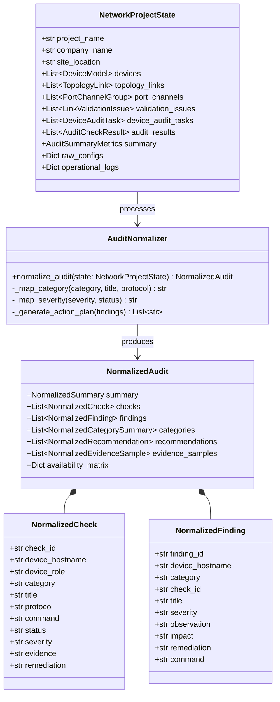
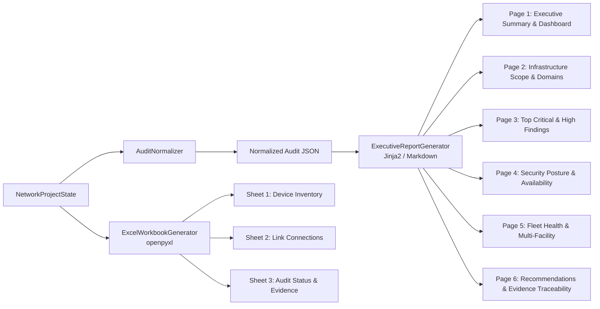

# Enterprise Network Infrastructure Audit Tool — System Architecture Document

## 1. Executive Summary & Architectural Overview

The **Enterprise Network Infrastructure Audit Tool** is a high-performance, vendor-agnostic network assessment and compliance platform. It orchestrates a rigorous multi-stage audit pipeline that transforms raw network configurations, interface topologies, and operational command logs into standardized, evidence-backed security and performance intelligence, executive summaries, and formal audit evidence workbooks.

A core architectural pillar is the **Normalized Audit Engine (`AuditNormalizer`)**, which establishes a strict **Single Source of Truth (SSOT)**. It ensures 100% mathematical consistency across the live audit interface, the normalized JSON API, and executive management reports:
$$\text{Category Compliance \%} = \left( \frac{\text{Passed Checks}}{\text{Total Executed Checks}} \right) \times 100$$

```mermaid
graph TD
    subgraph "Presentation Layer"
        UI[Master Dashboard: index.html]
        COMP[Jinja2 Components: Header, Stage 1-3, 8 Modals]
        JS[Modular Frontend JS: state, inventory, topology, audit, live_trigger, catalog, project]
        UI --> COMP
        UI --> JS
    end

    subgraph "API & Controller Layer (api/routers/)"
        APP[FastAPI App: app.py]
        R_STATE[State & Presets: state.py]
        R_DEV[Device Inventory: devices.py]
        R_TOPO[Topology & Links: topology.py]
        R_AUDIT[Audit & Live Automation: audit.py]
        R_PROJ[Projects & Workbooks: projects.py]
        R_CAT[Catalog Studio: catalog.py]
        R_REP[Reports & Exports: reports.py]
        APP --> R_STATE
        APP --> R_DEV
        APP --> R_TOPO
        APP --> R_AUDIT
        APP --> R_PROJ
        APP --> R_CAT
        APP --> R_REP
    end

    subgraph "Services & State Layer (services/)"
        SSOT[StateService: state_service.py<br/>Single Source of Truth]
        PRESET[PresetService: preset_service.py<br/>Multi-Tier Presets]
        SCHEMAS[API Schemas: api/schemas.py]
        R_STATE --> SSOT
        R_DEV --> SSOT
        R_TOPO --> SSOT
        R_AUDIT --> SSOT
        R_PROJ --> SSOT
        R_REP --> SSOT
        R_STATE --> PRESET
    end

    subgraph "Live Automation Engine (core/collector/)"
        RUNNER[AuditTriggerRunner<br/>Multi-Scope Execution]
        SIM[SimulationEngine<br/>CLI Command Simulation]
        VAL[CommandValidator<br/>Rule Evaluation]
        WRITER[LogWriter<br/>Hierarchical .cfg Disk Logging]
        R_AUDIT --> RUNNER
        RUNNER --> SIM
        RUNNER --> VAL
        RUNNER --> WRITER
    end

    subgraph "Rule & Audit Engines (engine/)"
        SSOT --> Stage1[Stage 1: Inventory & Role Engine]
        SSOT --> Stage2[Stage 2: Topology & Link Validation Engine]
        SSOT --> Stage3[Stage 3: Dynamic Protocol & Multi-Domain Audit]
        Stage3 --> ProtoCatalog[Protocol Catalog<br/>L2, L3, Security, Wireless, WAN]
        Stage3 --> CatMgr[CatalogManager<br/>No-Code Vendor & Scenario Studio]
        Stage3 --> SevEngine[Severity & Health Scoring Engine]
    end

    subgraph "Normalized Audit Engine (engine/audit_normalizer.py)"
        SSOT --> NORM[AuditNormalizer<br/>Single Source of Truth]
        NORM --> NJ[Normalized Audit JSON<br/>Checks: 27 | Pass: 26 | Warn: 1 | Fail: 0<br/>Findings: 1 | Recommendations: 1]
    end

    subgraph "Reporting & Export Engines (reporting/)"
        NJ --> ExecGen[Executive Report Generator<br/>6-Page Formal White-BG PDF / HTML / MD]
        SSOT --> ExcelGen[Excel Workbook Generator<br/>openpyxl Multi-Sheet Evidence]
        NJ --> R_AUDIT_NORM[GET /api/audit/normalized]
    end

    JS -->|REST API JSON & SSE Streams| APP
```

---

## 2. Architectural Design Principles

1. **Clean Layered Architecture & Separation of Concerns**:
   - **Presentation Layer**: Component-driven Jinja2 templates (`templates/components/` and `modals/`) and modular client JavaScript controllers (`static/js/modules/`).
   - **API & Application Controller Layer**: Decoupled, domain-focused FastAPI `APIRouter` modules (`api/routers/`) mounted via a clean bootstrap entrypoint (`app.py`).
   - **Service & State Management Layer**: Centralized Single Source of Truth state manager (`services/state_service.py`) providing thread-safe mutation and serialization.
   - **Live Automation & Telemetry Layer**: High-throughput execution orchestrator and SSE progress streaming engine (`core/collector/`).
   - **Normalized Audit Engine Layer**: Canonical data transformation layer (`engine/audit_normalizer.py`) producing standard `NormalizedAudit` records.
   - **Reporting Layer**: Publication-grade 6-page executive report generator and multi-tab openpyxl Excel evidence engine (`reporting/`).

2. **Single Source of Truth (SSOT) & 1:1 Mathematical Consistency**:
   All audit state is encapsulated in `NetworkProjectState`. The `AuditNormalizer` processes this state to guarantee that metrics displayed on the live dashboard match the executive report and normalized API to the exact integer. If 27 checks execute with 26 passes and 1 warning, both the UI and executive report display 27 total checks, 26 passes, 1 warning, 0 failures, 96.3% compliance, exactly 1 finding, and exactly 1 prioritized recommendation.

3. **Strict Hierarchy: Checks $\to$ Findings $\to$ Recommendations**:
   - **Checks**: Every individual test scenario executed against a target device (e.g. 27 checks).
   - **Findings**: Created **strictly** when a check evaluated to `FAIL` or `WARNING`. No findings are fabricated or extracted when checks pass.
   - **Recommendations**: Prioritized remediation directives generated directly and exclusively from verified findings.

4. **Five Canonical Audit Categories**:
   All vendor and domain scenarios map into five standard enterprise audit categories:
   - `Security` (AAA, SSH, SNMPv3, ACLs, Firewall policies)
   - `Availability` (STP, FHRP, Port-Channels, BFD, Dual Uplinks)
   - `Configuration` (VLANs, Interface IPs, Subnets, Hostnames, Baselines)
   - `Network Services` (NTP, Syslog, DNS, DHCP, LLDP/CDP)
   - `Performance` (Hardware Health, MTU, Duplex, Error Counters)

5. **Evidence Traceability**:
   Every executive finding maintains auditable lineage linking it to the originating Device Hostname, Check ID, Verification CLI Command, and Raw CLI Evidence.

---

## 3. Layered Component Architecture



### 3.1 Core Data Models ([core/models.py](file:///d:/Zenquix/NW_audit_tool/core/models.py))
- **`DeviceModel`**: Encapsulates device identity, hardware specs, role classification (Core, Distribution, Access, Firewall, Edge/WAN, Wireless), management IP, and auto-generated port inventory.
- **`TopologyLink`**: Represents physical/logical connections with speed matching and Port-Channel bundle metadata.
- **`PortChannelGroup`**: Represents aggregated links (LACP / static EtherChannel) linking source and target member interfaces.
- **`DeviceAuditTask`**: Granular, role-tailored verification task with vendor CLI command (`show` command), condition rules, and execution status (`Completed`, `Failed`, `Warning`).
- **`AuditCheckResult`**: Formal audit finding capturing category, expected vs. actual values, compliance status, severity, and evidence logs.

---

## 4. Subsystem Deep Dive

### 4.1 Topology & Validation Engine ([engine/topology_engine.py](file:///d:/Zenquix/NW_audit_tool/engine/topology_engine.py))
Executes the **Section 2.4 Multi-Tier Validation Engine**:
1. **Endpoint Bidirectional Synchronization**: Ensures no link connects a device to itself and validates reciprocal interface connectivity.
2. **Speed Mismatch Detection**: Verifies that both sides of an active link operate at identical speeds (e.g. 10G vs 1G mismatch triggers a `Medium` severity alert).
3. **Port-Channel Alignment**: Validates that interfaces assigned to a Port-Channel bundle have matching speeds and are correctly mapped on both terminating devices.
4. **Hierarchical Multi-Tier Placement**: Auto-calculates vertical visual tier coordinates ($Y$-bands: Edge/WAN $\rightarrow$ Firewall $\rightarrow$ Core $\rightarrow$ Distribution $\rightarrow$ Access $\rightarrow$ Wireless) and horizontal distribution ($X$-spacing) for interactive graph rendering.
5. **Real-time Free Port Filtering**: Computes available, unused ports per device dynamically to prevent duplicate physical assignments.

### 4.2 Dynamic Protocol Catalog ([engine/protocol_catalog.py](file:///d:/Zenquix/NW_audit_tool/engine/protocol_catalog.py))
Maintains a matrix of over 60 enterprise audit checks categorized across 10 functional domains:
- **Layer 2 Protocols**: STP root priority, BPDU Guard, loop protection, VLAN 1 avoidance, trunk pruning, MTU consistency.
- **Layer 3 Protocols**: OSPF Area 0 backbone integrity, BGP peer state / MD5 authentication, default gateway redundancy (HSRP/VRRP/GLBP).
- **Security & Firewall**: State-tracking rules, implicit deny, egress filtering, anti-spoofing (uRPF), management plane ACLs, SSH v2 enforcement.
- **Edge & WAN**: IPsec crypto profiles (AES-GCM / DH Group 19+), BFD timers, SD-WAN health probes.
- **Wireless Infrastructure**: 802.1X / WPA3-Enterprise, Fast Roaming (802.11r/k/v), rogue AP containment.
- **Management & Monitoring**: NTP stratum synchrony, SNMPv3 authPriv encryption, Syslog remote server redundancy, AAA/TACACS+ fallback.

### 4.3 Severity & Health Scoring Engine ([engine/severity_engine.py](file:///d:/Zenquix/NW_audit_tool/engine/severity_engine.py))
Calculates an objective, weighted infrastructure health score on a 0–100 scale:

$$\text{Health Score} = 100 - \sum (\text{Penalty} \times \text{Weight})$$

| Severity Level | Penalty Per Failure | Penalty Per Warning | Max Penalty Contribution |
| :--- | :---: | :---: | :---: |
| **Critical** | $-15$ | $-8$ | Uncapped (forces Critical risk) |
| **High** | $-10$ | $-5$ | Uncapped |
| **Medium** | $-5$ | $-2$ | Capped at $-30$ |
| **Low** | $-2$ | $-1$ | Capped at $-15$ |

### 4.4 Live Automation & Execution Engine ([core/collector/](file:///d:/Zenquix/NW_audit_tool/core/collector))
Orchestrates live CLI command execution and real-time telemetry streaming:
1. **AuditTriggerRunner**: Manages multi-scope execution (`all` devices, specific `device`, functional `section`, or individual `task`), credentials decryption (Password, Enable Secret, SSH Keys, API Tokens), and job status tracking.
2. **SimulationEngine**: Deterministic mock engine simulating realistic multi-vendor operational outputs (`show version`, `show interface`, `show ip ospf neighbor`, `show running-config`) for offline development and CI environments.
3. **CommandValidator**: Evaluates collected raw device outputs against protocol validation regex patterns and keyword rules, classifying outcomes into `Completed`, `Failed`, or `Warning`.
4. **LogWriter & Archiver**: Writes raw output files hierarchically to `files/<company>/<building>/<date>/<device>/sh_(cmd)_HHMMSS.cfg` and packages them into downloadable ZIP archives.
5. **SSE Progress Streamer**: Streams asynchronous execution events (`TASK_START`, `TASK_PROGRESS`, `TASK_OUTPUT`, `JOB_COMPLETED`) to the frontend in real time via Server-Sent Events.

### 4.5 Modular Vendor & Scenario Catalog Studio ([engine/catalog_manager.py](file:///d:/Zenquix/NW_audit_tool/engine/catalog_manager.py))
Enables zero-code extensibility for test scenarios and hardware platform profiles:
1. **Vendor Platform Registry**: Dynamically stores vendor profiles, device models, interface prefix templates, and OS versions in `config/vendor_catalog.json`.
2. **Test Scenario Registry**: Stores modular audit test cases and multi-vendor CLI verification commands in `config/test_scenarios.json`.
3. **1-Click Bulk Import/Export**: Fully supports exporting catalogs to standard JSON files and importing custom enterprise profiles without modifying Python code.

### 4.6 Normalized Audit Engine ([engine/audit_normalizer.py](file:///d:/Zenquix/NW_audit_tool/engine/audit_normalizer.py))
Serves as the Single Source of Truth for audit consolidation:
1. **Source Ingestion**: Ingests active audit checks from `state.device_audit_tasks` (preferred for live execution) or fallback `state.audit_results`.
2. **Category Precedence Mapping**: Resolves titles and protocols into the 5 canonical categories using specific precedence rules (e.g. IP addressing and subnet masks resolve to `Configuration`, preventing misclassification into `Network Services`).
3. **Strict Non-Pass Finding Isolation**: Extracts findings **only** when `status != "PASS"`. If all checks pass, findings count is strictly 0 and the action plan confirms no immediate remediations are required.
4. **Availability Matrix Resolution**: Maps live protocol statuses (`STP`, `RSTP`, `EtherChannel`, `LACP`, `HSRP`, `BFD`, `Dual Uplink`) to `Operational` or `Warning/Failed` based on actual task results, eliminating hardcoded placeholder warnings.
5. **Calculated Compliance Metrics**: Computes true percentage ratios per category and fleet-wide.

---

## 5. Reporting Subsystems



1. **Executive Management Decision Report ([reporting/executive_report.py](file:///d:/Zenquix/NW_audit_tool/reporting/executive_report.py))**:
   Produces a publication-ready, formal white-background 6-page document designed specifically for CIOs, CTOs, and Infrastructure Leadership. Features:
   - 5 KPI summary cards (Audited Devices, Executed Checks, Passed Checks, Warnings, and Compliance Rate %).
   - Table 03 domain breakdown displaying evaluated checks, pass/fail counts, and calculated compliance percentages.
   - Granular finding cards with Device Hostname, Category, Check ID, Verification Command, Observation, Potential Impact, and Remediation.
   - Protocol redundancy matrix derived from live audit findings.
   - Audit Evidence Traceability table linking findings directly to raw CLI evidence.
   - Available via Web UI, `/api/export/executive/html` (print-ready PDF styling), `/api/export/executive/md`, and programmatic `/api/audit/normalized`.

2. **Excel Evidence Workbook ([reporting/excel_generator.py](file:///d:/Zenquix/NW_audit_tool/reporting/excel_generator.py))**:
   Generates a formal multi-sheet workbook (`Audit_Evidence_Workbook.xlsx`) styled with custom corporate headers, auto-calculated column dimensions, zebra striping, and status color badges (`Passed` = Green, `Failed` = Crimson, `Warning` = Amber).

---

## 6. Technology Stack Architecture

| Tier | Technology | Purpose |
| :--- | :--- | :--- |
| **Runtime** | Python 3.10+ / 3.11 / 3.12 | High-performance core execution engine |
| **API Framework** | FastAPI / Starlette / Uvicorn | High-throughput asynchronous REST API & SSE streaming |
| **Data Validation** | Pydantic V2 | Type enforcement, serialization, schema validation |
| **Normalization** | `engine/audit_normalizer.py` | Canonical single source of truth transformation |
| **Spreadsheets** | openpyxl | Multi-sheet enterprise evidence workbook generation |
| **Document Templates** | Jinja2 | 6-page formal executive HTML/PDF report rendering |
| **Network SSH** | Netmiko / Paramiko | Concurrency-controlled SSH execution with ephemeral RAM credentials |
| **Frontend UI** | HTML5, Vanilla CSS3, Modern ES6+ JS | Zero-dependency, low-latency glassmorphic user interface |
