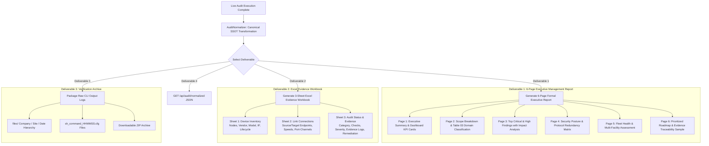

# Enterprise Network Infrastructure Audit Tool — Workflow Document

## 1. 4-Stage Network Infrastructure Audit Process

The platform operates through a rigorous, sequential 4-Stage audit process designed to ensure complete architectural visibility, physical topology validation, deep protocol-level compliance, automated live CLI execution, and normalized executive reporting.

```mermaid
sequenceDiagram
    autonumber
    actor Auditor as Lead Network Auditor
    participant UI as Audit Web Dashboard
    participant API as FastAPI APIRouters
    participant Svc as StateService (SSOT)
    participant Engine as Audit Orchestrator & Rule Engines
    participant Live as Live Automation Engine (core/collector)
    participant Norm as AuditNormalizer (SSOT Bridge)
    participant Rep as Reporting Generator

    %% PROJECT INIT
    rect rgb(15, 23, 42)
    note right of Auditor: Project Initialization & Quick Setup
    Auditor->>UI: Click "Create Blank File" (Company & Site Input)
    UI->>API: POST /api/project/new (NewProjectRequest)
    API->>Svc: Validate filename collisions & initialize state
    Svc-->>UI: Return fresh workspace & update headers
    end

    %% STAGE 1
    rect rgb(30, 41, 59)
    note right of Auditor: Stage 1: Inventory & Role Classification
    Auditor->>UI: Add Nodes (Vendor, Model, Role, Function, Management IP)
    UI->>API: POST /api/devices (DeviceModel JSON)
    API->>Engine: Run full audit & generate port inventory
    Engine->>Svc: Update active devices & task matrix
    Svc-->>UI: Return updated inventory table & node count
    end

    %% STAGE 2
    rect rgb(15, 23, 42)
    note right of Auditor: Stage 2: Topology & Link Validation
    Auditor->>UI: Connect Physical Interfaces (Unused Ports Only / LACP Port-Channels)
    UI->>API: POST /api/topology/link
    API->>Engine: Run Section 2.4 Link Validation & Tier Layout
    Engine->>Svc: Save links, port-channels, and validation alerts
    Svc-->>UI: Render interactive canvas graph & real-time validation badges
    end

    %% STAGE 3
    rect rgb(30, 41, 59)
    note right of Auditor: Stage 3: Dynamic Protocol Tasks & Live Automation
    alt Manual Evidence Entry
        Auditor->>UI: Update task status & evidence notes
        UI->>API: POST /api/audit/task/{id}/status
        API->>Svc: Update task verification state & recompute metrics
    else Live Automated Execution
        Auditor->>UI: Click "Run Live Audit" (Credentials & Scope: all/device/task)
        UI->>API: POST /api/audit/trigger (Stage3TriggerRequest)
        API->>Live: Launch AuditTriggerRunner asynchronously
        Live-->>UI: Return job_id & stream URL
        UI->>API: GET /api/audit/stream/{job_id} (Server-Sent Events)
        Live-->>UI: Stream real-time task progress, CLI output & status
        Live->>Live: Write .cfg logs to files/<company>/<site>/<date>/<device>/
    else Interactive On-the-Fly Retry
        Auditor->>UI: Edit failed CLI command & click Retry
        UI->>API: POST /api/audit/task/{id}/retry
        API->>Live: Re-execute custom command on device & validate
        Live-->>UI: Update task status to Completed if passed & save new .cfg
    end
    end

    %% STAGE 4: NORMALIZATION & DELIVERABLES
    rect rgb(15, 23, 42)
    note right of Auditor: Stage 4: Audit Normalization & Deliverables Generation
    Auditor->>UI: Request Deliverables (Excel / Executive Report / Normalized JSON)
    UI->>API: GET /api/export/executive/html, /api/audit/normalized, or /api/export/excel
    API->>Norm: normalize_audit(state)
    Norm-->>API: Return canonical NormalizedAudit dataset (1:1 consistency)
    API->>Rep: Render 6-Page Formal Executive Report & Multi-Sheet Excel
    API->>Live: Package raw .cfg files into ZIP archive
    Rep-->>Auditor: Deliver 6-Page Executive HTML/PDF & Formatted .xlsx
    Live-->>Auditor: Download raw CLI verification logs ZIP
    end
```

---

## 2. Stage-by-Stage Detailed Workflows

### Project Initialization & Blank File Setup
1. **Quick Setup Modal**:
   - The user clicks **✨ Create Blank File** from the Page 1 toolbar.
   - Enter `Company Name` (e.g. `Acme Corp`) and `Site / Location` (e.g. `HQ Primary DC`).
2. **Duplicate Project Name & File Validation**:
   - The backend checks if a workbook file named `<Company>_<Site>_Audit_Evidence.xlsx` already exists on disk.
   - If a duplicate exists, the API returns a `409 Conflict` error prompting the user to select distinct identifiers or restore the existing workbook.
3. **Dynamic Workspace Synchronization**:
   - Active headers (`Active Company: ...`, `Site Location: ...`) update dynamically across all UI stages without requiring a page reload.

---

### Stage 1: Device Inventory & Hardware Classification
1. **Node Ingestion**:
   - Devices are added with Vendor, Model, Hardware OS Version, Management IP, Function (`L2`, `L3`, `L2_L3`, `FIREWALL`, `WIRELESS`, `WAN`), and Tier Role (`CORE`, `DISTRIBUTION`, `ACCESS`, `FIREWALL`, `EDGE_WAN`, `WIRELESS`).
2. **Uniqueness Constraints**:
   - Hostnames, Management IPs, Device IDs, and Serial Numbers must be strictly unique across the inventory.
3. **Automated Port Catalog Generation**:
   - Interface names are auto-generated based on the vendor catalog naming patterns (e.g., `GigabitEthernet1/0/1-24` for Cisco, `ge-0/0/1-24` for Juniper, `Eth1-24` for Arista, `Port1-24` for Palo Alto, `1/1/1-2` for Aruba).
4. **Lifecycle & Hardware Health**:
   - Hardware lifecycle status (`Active`, `End-of-Sale`, `End-of-Support`, `Vulnerable`) is tracked for risk penalty computation.

---

### Stage 2: Network Connection Topology & Real-Time Link Validation
1. **Unused Port Calculation**:
   - The backend dynamically filters out already-connected interfaces, ensuring dropdowns only offer physically available ports.
2. **LACP Port-Channel Multi-Select Builder**:
   - Bundle multiple physical interfaces into Port-Channel groups (`Po1` - `Po999`).
   - Supports 1-to-1 multi-port mapping with uniform speed enforcement.
3. **Section 2.4 Real-Time Link Validation**:
   - **Self-Loop Prevention**: Blocks attempts to connect a device to itself.
   - **Speed Mismatch Alerting**: Flags links interconnecting ports with disparate speeds (e.g. 10G vs 1G) with a `Medium` severity issue and remediation guidance.
   - **Bidirectional Link Consistency**: Automatically synchronizes reciprocal source $\leftrightarrow$ target link records.
4. **Interactive Multi-Tier Graph & Custom Tiering**:
   - Draggable node cards, bezier connection paths, hover inspection cards, and 2x expanded tier spacing (`310px`).
   - **Custom Tiering**: Customizes role placement across Tier 1 through Tier 7 with dynamic labels and flow preview (`Top ➔ Bottom`).

---

### Stage 3: Dynamic Protocol Tasks, Multi-Domain Audit & Live Automation
1. **Dynamic Task Matrix Generation**:
   - The protocol catalog analyzes device role, classification, and connections, generating role-tailored checklists with vendor CLI `show` commands across 10 functional domains.
2. **Live Automated Execution Runner**:
   - Auditors can execute live verification across all devices, a single target device, a functional section, or an individual task.
   - Supports credentials input: Username, Password, Enable Secret, SSH Private Keys (RSA/OpenSSH), and API Tokens.
3. **Real-Time Progress via Server-Sent Events (SSE)**:
   - Progress bar, live execution logs drawer, and per-task status updates stream directly to the browser via `/api/audit/stream/{job_id}`.
4. **Interactive On-the-Fly Retry**:
   - If an automated check fails due to syntax differences, auditors can edit the command directly in the UI and click **Retry**. The system re-executes the command on the target device, verifies output, and updates the task to `Completed`.
5. **Hierarchical Log Archiving**:
   - Raw CLI output is saved to `files/<company>/<building>/<date>/<device>/sh_(cmd)_HHMMSS.cfg`.
   - 1-click ZIP archive export downloads all raw verification logs for audit provenance.
6. **Weighted Health Scoring Engine**:
   - The `SeverityEngine` deducts weighted penalties for each failed or warning check, generating the objective **0–100 Infrastructure Health Score** and **Overall Risk Rating**.

---

### Stage 4: Audit Normalization & Single Source of Truth
1. **Audit Normalizer Engine (`engine/audit_normalizer.py`)**:
   - Ingests active audit checks from `state.device_audit_tasks` (or fallback `state.audit_results`).
   - Maps vendor checks to the 5 canonical categories (`Security`, `Availability`, `Configuration`, `Network Services`, `Performance`).
   - Enforces the strict **Checks $\to$ Findings $\to$ Recommendations** hierarchy.
2. **1:1 Mathematical Consistency Guarantee**:
   - Ensures that the total executed checks (e.g. 27), passed checks (e.g. 26), warnings (e.g. 1), failures (e.g. 0), and compliance percentage (96.3%) match perfectly across the live dashboard, normalized JSON API, and executive report.
3. **Evidence Traceability Sample**:
   - Binds every finding to its Device Hostname, Check ID, Verification Command, Observation, and raw CLI evidence notes.

---

## 3. Deliverables & Reporting Workflow

---

## 4. Operational Error Handling & Validation Lifecycle

| Validation Point | Potential Error Condition | Engine Mitigation / Workflow Response |
| :--- | :--- | :--- |
| **Project Setup** | Duplicate `<Company>_<Site>` file on disk | Rejects creation with `409 Conflict` explaining file collision. |
| **Stage 1 (Node Addition)** | Duplicate Hostname, IP, or Serial Number | Rejects creation with `400 Bad Request` explaining duplicate conflict. |
| **Stage 2 (Link Creation)** | Selected interface already occupied | Dropdown dynamically filters allocated ports; backend enforces single occupancy. |
| **Stage 2 (Link Creation)** | Port Speed Mismatch (e.g. 10G to 1G) | Link is recorded with a `Medium` severity validation warning alert in the real-time alert panel. |
| **Stage 3 (Live Execution)**| SSH authentication failure / unreachable host | Job logs error in SSE drawer, flags task as `Failed`, and enables on-the-fly retry modal. |
| **Stage 3 (Task Retry)** | Custom command syntax failure | Re-executes command on device, displays captured CLI error, and maintains `Failed` status until resolved. |
| **Stage 4 (Normalization)** | Mismatched task counts or missing categories | `AuditNormalizer` applies canonical precedence rules and strictly derives findings from non-passing checks only. |
